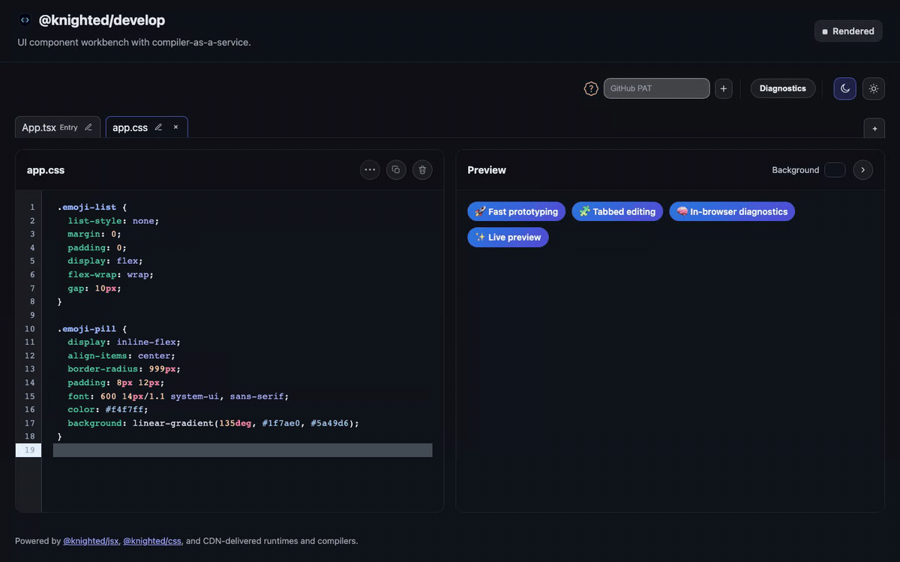

<h1>
	
	<code>@knighted/develop</code>
</h1>

CDN-first UI component workbench for rapid prototyping with [`@knighted/jsx`](https://github.com/knightedcodemonkey/jsx) and [`@knighted/css`](https://github.com/knightedcodemonkey/css).

## What it is

`@knighted/develop` is a browser-native UI component workbench that demonstrates
modern component authoring without a local bundler-first inner loop.

The app is designed to showcase two libraries:

- [`@knighted/jsx`](https://github.com/knightedcodemonkey/jsx) for DOM-first and React-mode JSX authoring
- [`@knighted/css`](https://github.com/knightedcodemonkey/css) for in-browser CSS compilation workflows

Dependencies are delivered over CDN ESM with on-demand loading by mode, so the
browser acts as the runtime host for render, lint, and typecheck flows.

## Core capabilities

`@knighted/develop` lets you:

- write component code in the browser
- manage dynamic workspace tabs with add, rename, remove, and entry-role protection
- switch render mode between DOM and React
- switch style mode between native CSS, CSS Modules, Less, and Sass
- run in-browser lint and type diagnostics
- open diagnostics in a shared drawer and jump to source locations
- toggle ShadowRoot preview isolation while iterating
- switch layout and theme while preserving fast feedback loops

## Try it

- Live workbench: https://knightedcodemonkey.github.io/develop/
- Source repository: https://github.com/knightedcodemonkey/develop

## BYOT Guide

- GitHub PAT setup and usage: [docs/byot.md](docs/byot.md)

## Editor Architecture

- Workspace-first editor architecture and migration notes: [docs/editor-workspace-architecture.md](docs/editor-workspace-architecture.md)

## Fine-Grained PAT Quick Setup

For PR/BYOT and AI chat flows, use a fine-grained GitHub PAT and follow the
existing setup guide:

- Full setup and behavior: [docs/byot.md](docs/byot.md)
- Repository permissions screenshot: [docs/media/byot-repo-perms.png](docs/media/byot-repo-perms.png)
- Models permission screenshot: [docs/media/byot-model-perms.png](docs/media/byot-model-perms.png)

## License

MIT
