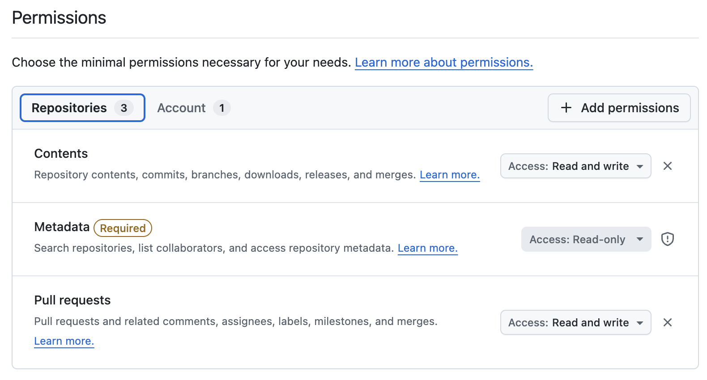
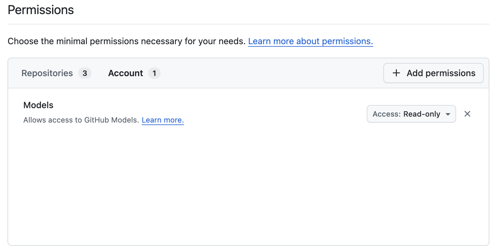

# BYOT Setup for GitHub in @knighted/develop

This guide explains how to create and use a fine-grained GitHub Personal Access Token (PAT) for the BYOT flow in `@knighted/develop`.

## What BYOT does in the app

When the AI/BYOT feature is enabled, the token is used to:

- authenticate GitHub API requests
- load repositories where you have write access
- let you choose which repository to work with

As additional AI/PR features roll out, the same token is also used for model and repository operations that require the configured permissions.

## Privacy and storage behavior

- Your token is stored only in your browser `localStorage`.
- The token is never sent to any service except the GitHub endpoints required by the feature.
- You can remove it at any time using the delete button in the BYOT controls.

## Enable the BYOT feature

Use one of these options:

1. Add `?feature-ai=true` to the app URL.
2. Set `localStorage` key `knighted:develop:feature:ai-assistant` to `true`.

## Create a fine-grained PAT

Create a fine-grained PAT in GitHub settings and grant the permissions below.

- Repository permissions screenshot: [docs/media/byot-repo-perms.png](docs/media/byot-repo-perms.png)
- Models permission screenshot: [docs/media/byot-model-perms.png](docs/media/byot-model-perms.png)

### Repository permissions

- Contents: Read and write
- Pull requests: Read and write
- Metadata: Read-only (required)

### Account permissions

- Models: Read-only

### Repository access scope

Use either of these scopes depending on your needs:

- Only select repositories
- All repositories

`@knighted/develop` will only show repositories where your token has write access.

## Recommended setup flow

1. Create token with the permissions above.
2. Open `@knighted/develop` with `?feature-ai=true`.
3. Paste token into the BYOT input and click add.
4. Verify repository list loads.
5. Select your target repository.

## Screenshots

The screenshots above show the recommended repository and account permission settings.
